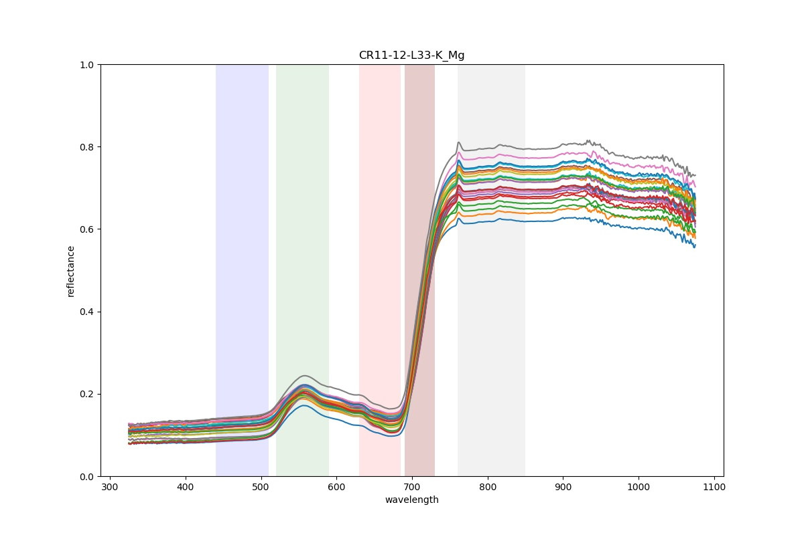
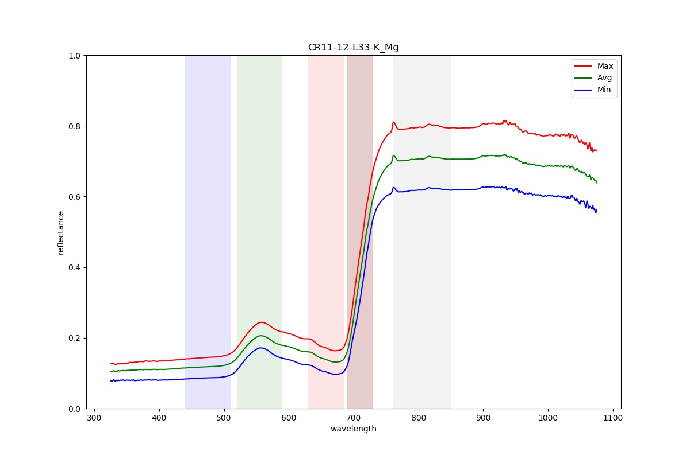

# spectrometer-process-tool

This is a program for extracting ASD to CSV and also generate spectral graph. it is based on SpecDal package.

### Table of contents

* [Required Software](#required-software)
* [Installation](#installation)
* [Data preparation](#data-preparation)
* [Configuration](#configuration)
* [Run program](#run-program)
* [Output](#output)


## Required Software
* Python 3 or above 
* Python pip3 (a Python package installer)
* SpecDal package

## Installation
* Clone the repository and then
* Install all requirement packages in requirements.txt using command 
  * pip install -r requirements.txt

## Data preparation
There are two set of input: asd files and asd_mapping_file. its location must be specified in the configuration file.

### asd file
output files from spectrometer

### asd mapping file 
It is a csv file contained mapping information of set of sample with asd files. It need to have following information. Example in `input/sample_mapping_template.csv`.

The file needs to contain the following data items:

```
PLOT,SAMPLE_ID,LEAF,HEALTH,ASD1
PLOT           : Plot code such as SR08, CR11,GT09
SAMPLE_ID      : Unique id of sample set such 1,2,3,4
LEAF           : LEAF information such as 9,17,33
HEALTH         : Health information of the tree such as Healthy,N, Mg. N mean lack of Nitrogen.
ASD1           : first ASD file
...
ASDXX          : last ASD file such ASD24

```
XX: must also specify in no_of_asd_per_sample in configuration file.


## Configuration
In `config_template.config` file, you need to assign input/output location and so on. 
Here is an example of a `config_template.config` file with an explanation.

* **`asd_path`** : specify path that store asd files.
* **`sample_mapping_file`** : spefify location of mapping file (csv).
* **`no_of_asd_per_sample`** : specify number of asd per sample (default:24).

* **`output_path`** : specify output path.
* **`output_csv`** : export csv (true/false).
* **`output_graph`** : export graph (true/false).

* **`graph_min`** : set min scale of graph.
* **`graph_max`** : set max scale of graph.

```
[INPUT]
asd_path = D:\spectrometer-process-tool\input\asd
sample_mapping_file = D:\spectrometer-process-tool\input\sample_mapping_template.csv
no_of_asd_per_sample = 24


[OUTPUT]
output_path = D:\spectrometer-process-tool\output
output_csv = true
output_graph = true

[PROCESSING]
graph_min = 0.0
graph_max = 1.0
```


## Run Program

* python3 run_asd_processing.py -c {config_file}
 
  ```
  python3 run_asd_processing.py -c config_template.conf
  ```

## output 
* csv file (Header: ASD_FILE,SAMPLE_CODE,Wavelength,...)
* reflectance graph of a sample with all asd


* min/max/avg reflectance graph of a sample


